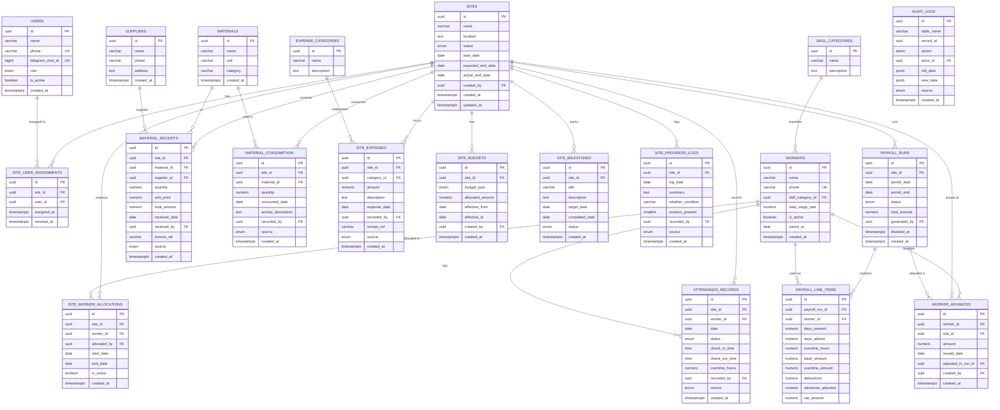

# 🗄️ Construction ERP — ER Diagram

> Rendered natively by GitHub via Mermaid. No plugins needed.

```mermaid
erDiagram

    %% ─── CORE ───────────────────────────────────────────
    SITES {
        uuid        id                PK
        varchar     name
        text        location
        enum        status
        date        start_date
        date        expected_end_date
        date        actual_end_date
        uuid        created_by        FK
        timestamptz created_at
        timestamptz updated_at
    }

    USERS {
        uuid        id                PK
        varchar     name
        varchar     phone             UK
        bigint      telegram_chat_id  UK
        enum        role
        boolean     is_active
        timestamptz created_at
    }

    SITE_USER_ASSIGNMENTS {
        uuid        id          PK
        uuid        site_id     FK
        uuid        user_id     FK
        timestamptz assigned_at
        timestamptz revoked_at
    }

    %% ─── WORKFORCE ──────────────────────────────────────
    SKILL_CATEGORIES {
        uuid    id          PK
        varchar name
        text    description
    }

    WORKERS {
        uuid        id                PK
        varchar     name
        varchar     phone             UK
        uuid        skill_category_id FK
        numeric     daily_wage_rate
        boolean     is_active
        date        joined_at
        timestamptz created_at
    }

    SITE_WORKER_ALLOCATIONS {
        uuid        id           PK
        uuid        site_id      FK
        uuid        worker_id    FK
        uuid        allocated_by FK
        date        start_date
        date        end_date
        boolean     is_active
        timestamptz created_at
    }

    %% ─── ATTENDANCE ─────────────────────────────────────
    ATTENDANCE_RECORDS {
        uuid        id             PK
        uuid        site_id        FK
        uuid        worker_id      FK
        date        date
        enum        status
        time        check_in_time
        time        check_out_time
        numeric     overtime_hours
        uuid        recorded_by    FK
        enum        source
        timestamptz created_at
    }

    %% ─── INVENTORY ──────────────────────────────────────
    MATERIALS {
        uuid        id         PK
        varchar     name
        varchar     unit
        varchar     category
        timestamptz created_at
    }

    SUPPLIERS {
        uuid        id         PK
        varchar     name
        varchar     phone
        text        address
        timestamptz created_at
    }

    MATERIAL_RECEIPTS {
        uuid        id            PK
        uuid        site_id       FK
        uuid        material_id   FK
        uuid        supplier_id   FK
        numeric     quantity
        numeric     unit_price
        numeric     total_amount
        date        received_date
        uuid        received_by   FK
        varchar     invoice_ref
        enum        source
        timestamptz created_at
    }

    MATERIAL_CONSUMPTION {
        uuid        id                   PK
        uuid        site_id              FK
        uuid        material_id          FK
        numeric     quantity
        date        consumed_date
        text        activity_description
        uuid        recorded_by          FK
        enum        source
        timestamptz created_at
    }

    %% ─── EXPENSES & BUDGET ──────────────────────────────
    EXPENSE_CATEGORIES {
        uuid    id          PK
        varchar name
        text    description
    }

    SITE_EXPENSES {
        uuid        id           PK
        uuid        site_id      FK
        uuid        category_id  FK
        numeric     amount
        text        description
        date        expense_date
        uuid        recorded_by  FK
        varchar     receipt_ref
        enum        source
        timestamptz created_at
    }

    SITE_BUDGETS {
        uuid        id               PK
        uuid        site_id          FK
        enum        budget_type
        numeric     allocated_amount
        date        effective_from
        date        effective_to
        uuid        created_by       FK
        timestamptz created_at
    }

    %% ─── PROGRESS ───────────────────────────────────────
    SITE_MILESTONES {
        uuid        id             PK
        uuid        site_id        FK
        varchar     title
        text        description
        date        target_date
        date        completed_date
        enum        status
        timestamptz created_at
    }

    SITE_PROGRESS_LOGS {
        uuid        id               PK
        uuid        site_id          FK
        date        log_date
        text        summary
        varchar     weather_condition
        smallint    workers_present
        uuid        recorded_by      FK
        enum        source
        timestamptz created_at
    }

    %% ─── PAYROLL (Admin only) ───────────────────────────
    PAYROLL_RUNS {
        uuid        id           PK
        uuid        site_id      FK
        date        period_start
        date        period_end
        enum        status
        numeric     total_amount
        uuid        generated_by FK
        timestamptz finalised_at
        timestamptz created_at
    }

    PAYROLL_LINE_ITEMS {
        uuid    id                 PK
        uuid    payroll_run_id     FK
        uuid    worker_id          FK
        numeric days_present
        numeric days_absent
        numeric overtime_hours
        numeric base_amount
        numeric overtime_amount
        numeric deductions
        numeric advances_adjusted
        numeric net_amount
    }

    WORKER_ADVANCES {
        uuid        id                  PK
        uuid        worker_id           FK
        uuid        site_id             FK
        numeric     amount
        date        issued_date
        uuid        adjusted_in_run_id  FK
        uuid        created_by          FK
        timestamptz created_at
    }

    %% ─── AUDIT ──────────────────────────────────────────
    AUDIT_LOGS {
        uuid        id         PK
        varchar     table_name
        uuid        record_id
        enum        action
        uuid        actor_id   FK
        jsonb       old_data
        jsonb       new_data
        enum        source
        timestamptz created_at
    }

    %% ═══════════════════════════════════════════════════
    %% RELATIONSHIPS
    %% ═══════════════════════════════════════════════════

    SITES                   ||--o{ SITE_USER_ASSIGNMENTS    : "has"
    USERS                   ||--o{ SITE_USER_ASSIGNMENTS    : "assigned to"

    SITES                   ||--o{ SITE_WORKER_ALLOCATIONS  : "employs"
    WORKERS                 ||--o{ SITE_WORKER_ALLOCATIONS  : "allocated to"
    SKILL_CATEGORIES        ||--o{ WORKERS                  : "classifies"

    SITES                   ||--o{ ATTENDANCE_RECORDS       : "records"
    WORKERS                 ||--o{ ATTENDANCE_RECORDS       : "has"

    SITES                   ||--o{ MATERIAL_RECEIPTS        : "receives"
    MATERIALS               ||--o{ MATERIAL_RECEIPTS        : "in"
    SUPPLIERS               ||--o{ MATERIAL_RECEIPTS        : "supplies"

    SITES                   ||--o{ MATERIAL_CONSUMPTION     : "consumes"
    MATERIALS               ||--o{ MATERIAL_CONSUMPTION     : "used in"

    SITES                   ||--o{ SITE_EXPENSES            : "incurs"
    EXPENSE_CATEGORIES      ||--o{ SITE_EXPENSES            : "categorises"

    SITES                   ||--o{ SITE_BUDGETS             : "has"

    SITES                   ||--o{ SITE_MILESTONES          : "tracks"
    SITES                   ||--o{ SITE_PROGRESS_LOGS       : "logs"

    SITES                   ||--o{ PAYROLL_RUNS             : "runs"
    PAYROLL_RUNS            ||--o{ PAYROLL_LINE_ITEMS       : "contains"
    WORKERS                 ||--o{ PAYROLL_LINE_ITEMS       : "paid via"

    WORKERS                 ||--o{ WORKER_ADVANCES          : "receives"
    SITES                   ||--o{ WORKER_ADVANCES          : "issued at"
    PAYROLL_RUNS            ||--o{ WORKER_ADVANCES          : "adjusted in"
```
