# Construction Enterprise Resource Planning System

## Project Overview

The Construction ERP & Resource Management System is an AI-powered, site-centric enterprise management platform designed for construction contractors to efficiently manage workforce operations, inventory movement, procurement activities, project budgets, and site-level execution from a centralized system.

The platform combines Telegram-based operational workflows, PostgreSQL-backed data management, AI-assisted data extraction through tool-calling agents, and a web-based analytics dashboard to streamline daily construction operations. The system enables supervisors and managers to record attendance, assign workers, manage material transactions, monitor project progress, track budgets, and generate operational reports without relying on traditional paper-based processes.

The platform is specifically designed for small and medium-scale construction businesses that require a practical and scalable solution for managing multiple sites while maintaining complete visibility over labour, materials, expenses, and project performance.

---

## Objective

To develop a centralized Construction ERP platform that digitizes and automates construction site operations by integrating workforce management, inventory management, procurement tracking, project budgeting, operational reporting, and AI-powered decision support.

The system aims to:

* Digitize daily construction operations.
* Centralize workforce and inventory records.
* Track site-wise material consumption and procurement.
* Automate attendance and payroll-related workflows.
* Monitor project budgets and expenses.
* Generate daily, weekly, and monthly operational reports.
* Provide management with real-time visibility across all active sites.
* Enable natural language interaction through AI-powered assistants.
* Build a historical data repository for future analytics and forecasting.

---

## Problem Statement

Small and medium-scale construction contractors frequently manage labour attendance, worker allocation, material procurement, inventory tracking, and project progress through manual registers, spreadsheets, phone calls, and messaging applications.

This approach often leads to:

* Inaccurate attendance records.
* Poor visibility across multiple construction sites.
* Untracked material consumption.
* Inefficient inventory management.
* Budget overruns.
* Delayed reporting.
* Lack of historical operational data.
* Difficulty in generating actionable business insights.

The absence of a centralized management platform limits operational efficiency and makes data-driven decision-making difficult.

This project addresses these challenges by providing an integrated Construction ERP solution that centralizes operational data, automates business workflows, and enables intelligent reporting through AI-assisted systems.

---

## User & Module Identification

The Construction ERP & Management Intelligence Platform is designed to centralize construction operations through multiple interconnected modules. Site Supervisors use the Telegram interface for operational data entry, while Contractors, Project Managers, Accountants, and Administrators access the web platform for monitoring, reporting, payroll management, and business analytics. The system also includes an AI-powered Management Assistant that enables authorized users to retrieve operational insights and reports using natural language queries.

---

## Modules list

* Workforce Management Module
* Site Management Module
* Inventory & Procurement Management Module
* Budget & Expense Management Module
* Payroll & Accounting Module
* Dashboard & Analytics Module
* AI Management Assistant Module
* Authentication & Access Control Module
  
---

## System Use Case Overview

## Site-Centric Module Breakdown

---

## Database Requirement Analysis

The Construction ERP system requires a centralized PostgreSQL database to manage workforce operations, site activities, inventory movement, procurement records, expenses, payroll information, and project progress. The database follows a site-centric architecture where every operational activity is associated with a construction site. It is designed to support real-time data entry through Telegram, secure data management through the web platform, AI-assisted querying, report generation, and historical data analysis for management decision-making.

### Table List

| Table Name            | Description                                                           |
| --------------------- | --------------------------------------------------------------------- |
| Users                 | Stores system user accounts and authentication details.               |
| Roles                 | Stores user roles and access permissions.                             |
| Sites                 | Stores construction site and project information.                     |
| Employees             | Stores worker and employee details.                                   |
| Site_Assignments      | Maps employees to specific construction sites.                        |
| Attendance            | Stores daily attendance records.                                      |
| Materials             | Stores material master data.                                          |
| Suppliers             | Stores supplier and vendor information.                               |
| Material_Transactions | Tracks procurement, consumption, and inventory movement.              |
| Expenses              | Stores site-related expenses and operational costs.                   |
| Progress_Updates      | Stores project progress and daily work updates.                       |
| Payroll_Periods       | Stores payroll cycle information.                                     |
| Payroll_Records       | Stores employee wage and payroll details.                             |
| Payments              | Tracks payroll and payment transactions.                              |
| Audit_Logs            | Stores system activity and transaction history for auditing purposes. |

---

## ER Diagram

Classic Chen notation — rectangles are entities, diamonds are relationships, ovals are attributes.

| Symbol | Meaning |
|--------|---------|
| 🟧 Rectangle (orange border) | Core entity (Sites, Users) |
| 🟥 Rectangle (red border) | Admin-only entity (Payroll, Budgets) |
| 🟩 Rectangle (green border) | Operational entity (Attendance, Materials) |
| ◇ Diamond | Relationship between entities |
| ○ Oval | Attribute of an entity |
| `1 — M` | One-to-many cardinality |
| Dashed line | Cross-module foreign key reference |

**Key relationships at a glance:**

- `SITES` is the central hub — every operational table has a `site_id` FK
- `WORKERS` → `ATTENDANCE_RECORDS` → `PAYROLL_LINE_ITEMS` is the attendance-to-payroll chain
- `MATERIAL_RECEIPTS` and `MATERIAL_CONSUMPTION` are both connected to `SITES` + `MATERIALS`
- `PAYROLL_RUNS`, `SITE_BUDGETS`, `WORKER_ADVANCES` are admin-only (red border)
- `AUDIT_LOGS` is a cross-cutting system table — not shown with a parent entity

---

## Database Schema

### Module Overview

| Module | Tables | Access |
|--------|--------|--------|
| Core | `sites`, `users`, `site_user_assignments` | All roles |
| Workforce | `workers`, `skill_categories`, `site_worker_allocations` | Supervisor (Telegram), Manager (Web) |
| Attendance | `attendance_records` | Supervisor (Telegram) |
| Inventory | `materials`, `suppliers`, `material_receipts`, `material_consumption` | Supervisor (Telegram) |
| Expenses & Budget | `expense_categories`, `site_expenses`, `site_budgets` | Supervisor (ops), Admin (budgets) |
| Progress | `site_milestones`, `site_progress_logs` | Supervisor (Telegram) |
| Payroll | `payroll_runs`, `payroll_line_items`, `worker_advances` | ⚠ Admin only |
| Audit | `audit_logs` | System only |

### Schema Design

> Rendered natively by GitHub via Mermaid. No plugins needed.

```mermaid
erDiagram

    %% ─── CORE ───────────────────────────────────────────
    SITES {
        uuid        id                PK
        varchar     name
        text        location
        enum        status
        date        start_date
        date        expected_end_date
        date        actual_end_date
        uuid        created_by        FK
        timestamptz created_at
        timestamptz updated_at
    }

    USERS {
        uuid        id                PK
        varchar     name
        varchar     phone             UK
        bigint      telegram_chat_id  UK
        enum        role
        boolean     is_active
        timestamptz created_at
    }

    SITE_USER_ASSIGNMENTS {
        uuid        id          PK
        uuid        site_id     FK
        uuid        user_id     FK
        timestamptz assigned_at
        timestamptz revoked_at
    }

    %% ─── WORKFORCE ──────────────────────────────────────
    SKILL_CATEGORIES {
        uuid    id          PK
        varchar name
        text    description
    }

    WORKERS {
        uuid        id                PK
        varchar     name
        varchar     phone             UK
        uuid        skill_category_id FK
        numeric     daily_wage_rate
        boolean     is_active
        date        joined_at
        timestamptz created_at
    }

    SITE_WORKER_ALLOCATIONS {
        uuid        id           PK
        uuid        site_id      FK
        uuid        worker_id    FK
        uuid        allocated_by FK
        date        start_date
        date        end_date
        boolean     is_active
        timestamptz created_at
    }

    %% ─── ATTENDANCE ─────────────────────────────────────
    ATTENDANCE_RECORDS {
        uuid        id             PK
        uuid        site_id        FK
        uuid        worker_id      FK
        date        date
        enum        status
        time        check_in_time
        time        check_out_time
        numeric     overtime_hours
        uuid        recorded_by    FK
        enum        source
        timestamptz created_at
    }

    %% ─── INVENTORY ──────────────────────────────────────
    MATERIALS {
        uuid        id         PK
        varchar     name
        varchar     unit
        varchar     category
        timestamptz created_at
    }

    SUPPLIERS {
        uuid        id         PK
        varchar     name
        varchar     phone
        text        address
        timestamptz created_at
    }

    MATERIAL_RECEIPTS {
        uuid        id            PK
        uuid        site_id       FK
        uuid        material_id   FK
        uuid        supplier_id   FK
        numeric     quantity
        numeric     unit_price
        numeric     total_amount
        date        received_date
        uuid        received_by   FK
        varchar     invoice_ref
        enum        source
        timestamptz created_at
    }

    MATERIAL_CONSUMPTION {
        uuid        id                   PK
        uuid        site_id              FK
        uuid        material_id          FK
        numeric     quantity
        date        consumed_date
        text        activity_description
        uuid        recorded_by          FK
        enum        source
        timestamptz created_at
    }

    %% ─── EXPENSES & BUDGET ──────────────────────────────
    EXPENSE_CATEGORIES {
        uuid    id          PK
        varchar name
        text    description
    }

    SITE_EXPENSES {
        uuid        id           PK
        uuid        site_id      FK
        uuid        category_id  FK
        numeric     amount
        text        description
        date        expense_date
        uuid        recorded_by  FK
        varchar     receipt_ref
        enum        source
        timestamptz created_at
    }

    SITE_BUDGETS {
        uuid        id               PK
        uuid        site_id          FK
        enum        budget_type
        numeric     allocated_amount
        date        effective_from
        date        effective_to
        uuid        created_by       FK
        timestamptz created_at
    }

    %% ─── PROGRESS ───────────────────────────────────────
    SITE_MILESTONES {
        uuid        id             PK
        uuid        site_id        FK
        varchar     title
        text        description
        date        target_date
        date        completed_date
        enum        status
        timestamptz created_at
    }

    SITE_PROGRESS_LOGS {
        uuid        id               PK
        uuid        site_id          FK
        date        log_date
        text        summary
        varchar     weather_condition
        smallint    workers_present
        uuid        recorded_by      FK
        enum        source
        timestamptz created_at
    }

    %% ─── PAYROLL (Admin only) ───────────────────────────
    PAYROLL_RUNS {
        uuid        id           PK
        uuid        site_id      FK
        date        period_start
        date        period_end
        enum        status
        numeric     total_amount
        uuid        generated_by FK
        timestamptz finalised_at
        timestamptz created_at
    }

    PAYROLL_LINE_ITEMS {
        uuid    id                 PK
        uuid    payroll_run_id     FK
        uuid    worker_id          FK
        numeric days_present
        numeric days_absent
        numeric overtime_hours
        numeric base_amount
        numeric overtime_amount
        numeric deductions
        numeric advances_adjusted
        numeric net_amount
    }

    WORKER_ADVANCES {
        uuid        id                  PK
        uuid        worker_id           FK
        uuid        site_id             FK
        numeric     amount
        date        issued_date
        uuid        adjusted_in_run_id  FK
        uuid        created_by          FK
        timestamptz created_at
    }

    %% ─── AUDIT ──────────────────────────────────────────
    AUDIT_LOGS {
        uuid        id         PK
        varchar     table_name
        uuid        record_id
        enum        action
        uuid        actor_id   FK
        jsonb       old_data
        jsonb       new_data
        enum        source
        timestamptz created_at
    }

    %% ═══════════════════════════════════════════════════
    %% RELATIONSHIPS
    %% ═══════════════════════════════════════════════════

    SITES                   ||--o{ SITE_USER_ASSIGNMENTS    : "has"
    USERS                   ||--o{ SITE_USER_ASSIGNMENTS    : "assigned to"

    SITES                   ||--o{ SITE_WORKER_ALLOCATIONS  : "employs"
    WORKERS                 ||--o{ SITE_WORKER_ALLOCATIONS  : "allocated to"
    SKILL_CATEGORIES        ||--o{ WORKERS                  : "classifies"

    SITES                   ||--o{ ATTENDANCE_RECORDS       : "records"
    WORKERS                 ||--o{ ATTENDANCE_RECORDS       : "has"

    SITES                   ||--o{ MATERIAL_RECEIPTS        : "receives"
    MATERIALS               ||--o{ MATERIAL_RECEIPTS        : "in"
    SUPPLIERS               ||--o{ MATERIAL_RECEIPTS        : "supplies"

    SITES                   ||--o{ MATERIAL_CONSUMPTION     : "consumes"
    MATERIALS               ||--o{ MATERIAL_CONSUMPTION     : "used in"

    SITES                   ||--o{ SITE_EXPENSES            : "incurs"
    EXPENSE_CATEGORIES      ||--o{ SITE_EXPENSES            : "categorises"

    SITES                   ||--o{ SITE_BUDGETS             : "has"

    SITES                   ||--o{ SITE_MILESTONES          : "tracks"
    SITES                   ||--o{ SITE_PROGRESS_LOGS       : "logs"

    SITES                   ||--o{ PAYROLL_RUNS             : "runs"
    PAYROLL_RUNS            ||--o{ PAYROLL_LINE_ITEMS       : "contains"
    WORKERS                 ||--o{ PAYROLL_LINE_ITEMS       : "paid via"

    WORKERS                 ||--o{ WORKER_ADVANCES          : "receives"
    SITES                   ||--o{ WORKER_ADVANCES          : "issued at"
    PAYROLL_RUNS            ||--o{ WORKER_ADVANCES          : "adjusted in"
```

