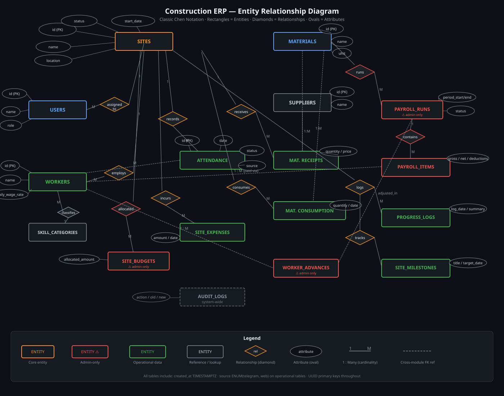
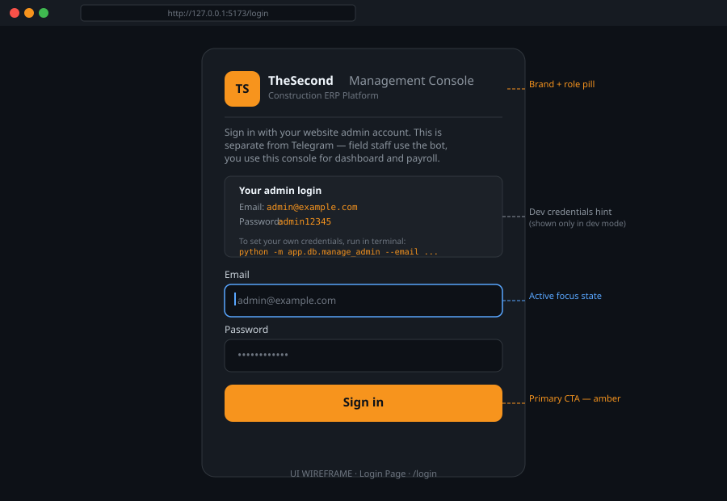
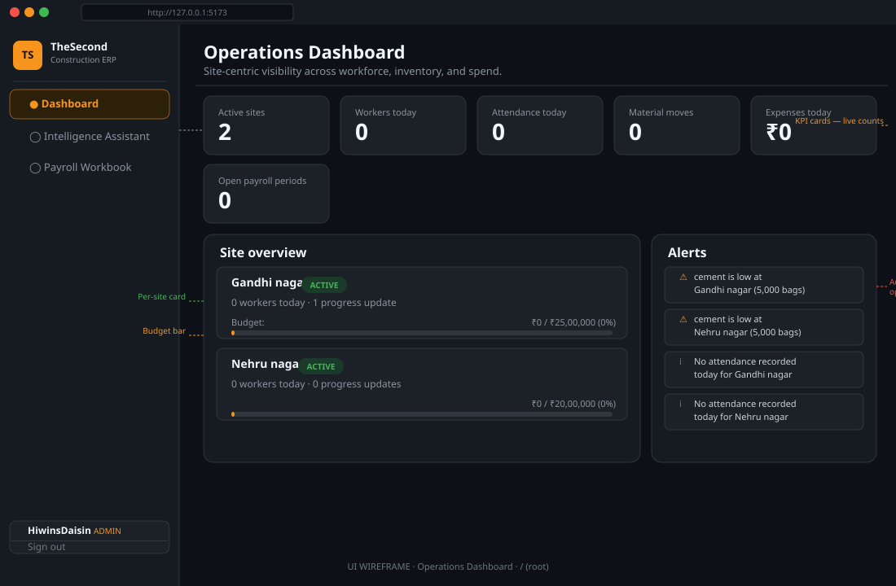
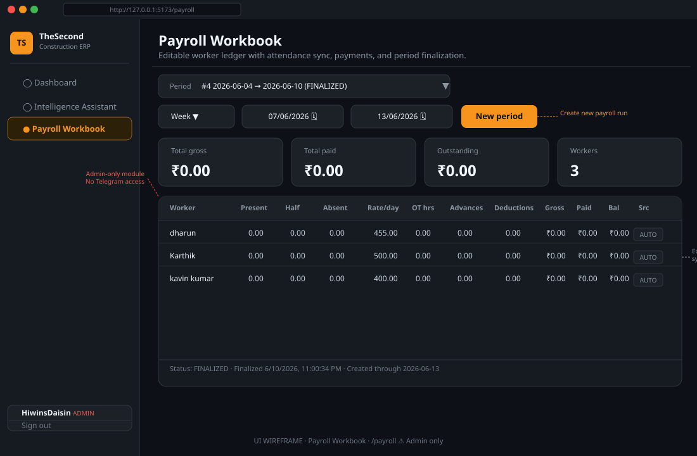
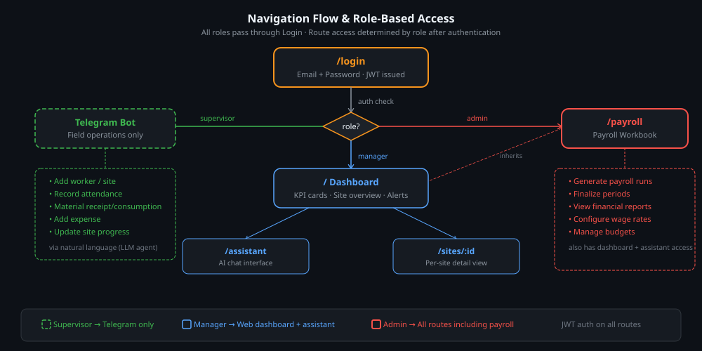

# Construction Enterprise Resource Planning System

## Project Overview

The Construction ERP & Resource Management System is an AI-powered, site-centric enterprise management platform designed for construction contractors to efficiently manage workforce operations, inventory movement, procurement activities, project budgets, and site-level execution from a centralized system.

The platform combines Telegram-based operational workflows, PostgreSQL-backed data management, AI-assisted data extraction through tool-calling agents, and a web-based analytics dashboard to streamline daily construction operations. The system enables supervisors and managers to record attendance, assign workers, manage material transactions, monitor project progress, track budgets, and generate operational reports without relying on traditional paper-based processes.

The platform is specifically designed for small and medium-scale construction businesses that require a practical and scalable solution for managing multiple sites while maintaining complete visibility over labour, materials, expenses, and project performance.

---

## Objective

To develop a centralized Construction ERP platform that digitizes and automates construction site operations by integrating workforce management, inventory management, procurement tracking, project budgeting, operational reporting, and AI-powered decision support.

The system aims to:

* Digitize daily construction operations.
* Centralize workforce and inventory records.
* Track site-wise material consumption and procurement.
* Automate attendance and payroll-related workflows.
* Monitor project budgets and expenses.
* Generate daily, weekly, and monthly operational reports.
* Provide management with real-time visibility across all active sites.
* Enable natural language interaction through AI-powered assistants.
* Build a historical data repository for future analytics and forecasting.

---

## Problem Statement

Small and medium-scale construction contractors frequently manage labour attendance, worker allocation, material procurement, inventory tracking, and project progress through manual registers, spreadsheets, phone calls, and messaging applications.

This approach often leads to:

* Inaccurate attendance records.
* Poor visibility across multiple construction sites.
* Untracked material consumption.
* Inefficient inventory management.
* Budget overruns.
* Delayed reporting.
* Lack of historical operational data.
* Difficulty in generating actionable business insights.

The absence of a centralized management platform limits operational efficiency and makes data-driven decision-making difficult.

This project addresses these challenges by providing an integrated Construction ERP solution that centralizes operational data, automates business workflows, and enables intelligent reporting through AI-assisted systems.

---

## User & Module Identification

The Construction ERP & Management Intelligence Platform is designed to centralize construction operations through multiple interconnected modules. Site Supervisors use the Telegram interface for operational data entry, while Contractors, Project Managers, Accountants, and Administrators access the web platform for monitoring, reporting, payroll management, and business analytics. The system also includes an AI-powered Management Assistant that enables authorized users to retrieve operational insights and reports using natural language queries.

---

## Modules list

* Workforce Management Module
* Site Management Module
* Inventory & Procurement Management Module
* Budget & Expense Management Module
* Payroll & Accounting Module
* Dashboard & Analytics Module
* AI Management Assistant Module
* Authentication & Access Control Module
  
---

## System Use Case Overview


## Site-Centric Module Breakdown


---

## Database Requirement Analysis

The Construction ERP system requires a centralized PostgreSQL database to manage workforce operations, site activities, inventory movement, procurement records, expenses, payroll information, and project progress. The database follows a site-centric architecture where every operational activity is associated with a construction site. It is designed to support real-time data entry through Telegram, secure data management through the web platform, AI-assisted querying, report generation, and historical data analysis for management decision-making.

### Table List

| Table Name            | Description                                                           |
| --------------------- | --------------------------------------------------------------------- |
| Users                 | Stores system user accounts and authentication details.               |
| Roles                 | Stores user roles and access permissions.                             |
| Sites                 | Stores construction site and project information.                     |
| Employees             | Stores worker and employee details.                                   |
| Site_Assignments      | Maps employees to specific construction sites.                        |
| Attendance            | Stores daily attendance records.                                      |
| Materials             | Stores material master data.                                          |
| Suppliers             | Stores supplier and vendor information.                               |
| Material_Transactions | Tracks procurement, consumption, and inventory movement.              |
| Expenses              | Stores site-related expenses and operational costs.                   |
| Progress_Updates      | Stores project progress and daily work updates.                       |
| Payroll_Periods       | Stores payroll cycle information.                                     |
| Payroll_Records       | Stores employee wage and payroll details.                             |
| Payments              | Tracks payroll and payment transactions.                              |
| Audit_Logs            | Stores system activity and transaction history for auditing purposes. |

---

## ER Diagram

Classic Chen notation — rectangles are entities, diamonds are relationships, ovals are attributes.



| Symbol | Meaning |
|--------|---------|
| 🟧 Rectangle (orange border) | Core entity (Sites, Users) |
| 🟥 Rectangle (red border) | Admin-only entity (Payroll, Budgets) |
| 🟩 Rectangle (green border) | Operational entity (Attendance, Materials) |
| ◇ Diamond | Relationship between entities |
| ○ Oval | Attribute of an entity |
| `1 — M` | One-to-many cardinality |
| Dashed line | Cross-module foreign key reference |

**Key relationships at a glance:**

- `SITES` is the central hub — every operational table has a `site_id` FK
- `WORKERS` → `ATTENDANCE_RECORDS` → `PAYROLL_LINE_ITEMS` is the attendance-to-payroll chain
- `MATERIAL_RECEIPTS` and `MATERIAL_CONSUMPTION` are both connected to `SITES` + `MATERIALS`
- `PAYROLL_RUNS`, `SITE_BUDGETS`, `WORKER_ADVANCES` are admin-only (red border)
- `AUDIT_LOGS` is a cross-cutting system table — not shown with a parent entity

---

## Database Schema

### Module Overview

| Module | Tables | Access |
|--------|--------|--------|
| Core | `sites`, `users`, `site_user_assignments` | All roles |
| Workforce | `workers`, `skill_categories`, `site_worker_allocations` | Supervisor (Telegram), Manager (Web) |
| Attendance | `attendance_records` | Supervisor (Telegram) |
| Inventory | `materials`, `suppliers`, `material_receipts`, `material_consumption` | Supervisor (Telegram) |
| Expenses & Budget | `expense_categories`, `site_expenses`, `site_budgets` | Supervisor (ops), Admin (budgets) |
| Progress | `site_milestones`, `site_progress_logs` | Supervisor (Telegram) |
| Payroll | `payroll_runs`, `payroll_line_items`, `worker_advances` | ⚠ Admin only |
| Audit | `audit_logs` | System only |

### Schema Design

> Rendered natively by GitHub via Mermaid. No plugins needed.


### Design Conventions

- **UUID** primary keys on all tables — safe for concurrent writes from Telegram + Web
- **`source ENUM(telegram, web)`** on all operational tables — tracks which channel created each record
- **`TIMESTAMPTZ`** on all timestamp columns — timezone-aware for field operations
- Payroll figures are never stored as running totals — always derived from line items at query time
- Current stock = `SUM(material_receipts.quantity) - SUM(material_consumption.quantity)` per site+material

### Full SQL Schema

<details>
<summary>Click to expand — Core entities</summary>

```sql
-- ─── SITES ────────────────────────────────────────────────────
CREATE TABLE sites (
    id                UUID PRIMARY KEY DEFAULT gen_random_uuid(),
    name              VARCHAR(150) NOT NULL,
    location          TEXT,
    status            VARCHAR(20) NOT NULL DEFAULT 'active'
                      CHECK (status IN ('active', 'completed', 'on_hold')),
    start_date        DATE,
    expected_end_date DATE,
    actual_end_date   DATE,
    created_by        UUID REFERENCES users(id),
    created_at        TIMESTAMPTZ NOT NULL DEFAULT NOW(),
    updated_at        TIMESTAMPTZ NOT NULL DEFAULT NOW()
);

-- ─── USERS ────────────────────────────────────────────────────
CREATE TABLE users (
    id               UUID PRIMARY KEY DEFAULT gen_random_uuid(),
    name             VARCHAR(120) NOT NULL,
    phone            VARCHAR(20) UNIQUE,
    telegram_chat_id BIGINT UNIQUE,
    role             VARCHAR(20) NOT NULL DEFAULT 'supervisor'
                     CHECK (role IN ('admin', 'manager', 'supervisor')),
    is_active        BOOLEAN NOT NULL DEFAULT TRUE,
    created_at       TIMESTAMPTZ NOT NULL DEFAULT NOW()
);

-- ─── SITE_USER_ASSIGNMENTS ────────────────────────────────────
CREATE TABLE site_user_assignments (
    id          UUID PRIMARY KEY DEFAULT gen_random_uuid(),
    site_id     UUID NOT NULL REFERENCES sites(id) ON DELETE CASCADE,
    user_id     UUID NOT NULL REFERENCES users(id) ON DELETE CASCADE,
    assigned_at TIMESTAMPTZ NOT NULL DEFAULT NOW(),
    revoked_at  TIMESTAMPTZ,
    UNIQUE (site_id, user_id)
);
```

</details>

<details>
<summary>Click to expand — Workforce</summary>

```sql
-- ─── SKILL_CATEGORIES ─────────────────────────────────────────
CREATE TABLE skill_categories (
    id          UUID PRIMARY KEY DEFAULT gen_random_uuid(),
    name        VARCHAR(80) NOT NULL UNIQUE,
    description TEXT
);

-- ─── WORKERS ──────────────────────────────────────────────────
CREATE TABLE workers (
    id                UUID PRIMARY KEY DEFAULT gen_random_uuid(),
    name              VARCHAR(120) NOT NULL,
    phone             VARCHAR(20) UNIQUE,
    skill_category_id UUID REFERENCES skill_categories(id),
    daily_wage_rate   NUMERIC(10,2) NOT NULL DEFAULT 0,
    is_active         BOOLEAN NOT NULL DEFAULT TRUE,
    joined_at         DATE,
    created_at        TIMESTAMPTZ NOT NULL DEFAULT NOW()
);

CREATE INDEX idx_workers_name ON workers(name);

-- ─── SITE_WORKER_ALLOCATIONS ──────────────────────────────────
CREATE TABLE site_worker_allocations (
    id           UUID PRIMARY KEY DEFAULT gen_random_uuid(),
    site_id      UUID NOT NULL REFERENCES sites(id) ON DELETE CASCADE,
    worker_id    UUID NOT NULL REFERENCES workers(id),
    allocated_by UUID REFERENCES users(id),
    start_date   DATE NOT NULL,
    end_date     DATE,
    is_active    BOOLEAN NOT NULL DEFAULT TRUE,
    created_at   TIMESTAMPTZ NOT NULL DEFAULT NOW()
);
```

</details>

<details>
<summary>Click to expand — Attendance</summary>

```sql
-- ─── ATTENDANCE_RECORDS ───────────────────────────────────────
CREATE TABLE attendance_records (
    id             UUID PRIMARY KEY DEFAULT gen_random_uuid(),
    site_id        UUID NOT NULL REFERENCES sites(id) ON DELETE CASCADE,
    worker_id      UUID NOT NULL REFERENCES workers(id),
    date           DATE NOT NULL,
    status         VARCHAR(20) NOT NULL DEFAULT 'present'
                   CHECK (status IN ('present', 'absent', 'half_day', 'holiday')),
    check_in_time  TIME,
    check_out_time TIME,
    overtime_hours NUMERIC(4,2) NOT NULL DEFAULT 0,
    recorded_by    UUID REFERENCES users(id),
    source         VARCHAR(10) NOT NULL DEFAULT 'telegram'
                   CHECK (source IN ('telegram', 'web')),
    created_at     TIMESTAMPTZ NOT NULL DEFAULT NOW(),
    UNIQUE (site_id, worker_id, date)
);

CREATE INDEX idx_attendance_date ON attendance_records(date);
CREATE INDEX idx_attendance_site ON attendance_records(site_id);
```

</details>

<details>
<summary>Click to expand — Inventory & Materials</summary>

```sql
-- ─── MATERIALS ────────────────────────────────────────────────
CREATE TABLE materials (
    id         UUID PRIMARY KEY DEFAULT gen_random_uuid(),
    name       VARCHAR(120) NOT NULL,
    unit       VARCHAR(30) NOT NULL,
    category   VARCHAR(60),
    created_at TIMESTAMPTZ NOT NULL DEFAULT NOW()
);

CREATE INDEX idx_materials_name ON materials(name);

-- ─── SUPPLIERS ────────────────────────────────────────────────
CREATE TABLE suppliers (
    id         UUID PRIMARY KEY DEFAULT gen_random_uuid(),
    name       VARCHAR(150) NOT NULL,
    phone      VARCHAR(20),
    address    TEXT,
    created_at TIMESTAMPTZ NOT NULL DEFAULT NOW()
);

-- ─── MATERIAL_RECEIPTS ────────────────────────────────────────
CREATE TABLE material_receipts (
    id            UUID PRIMARY KEY DEFAULT gen_random_uuid(),
    site_id       UUID NOT NULL REFERENCES sites(id) ON DELETE CASCADE,
    material_id   UUID NOT NULL REFERENCES materials(id),
    supplier_id   UUID REFERENCES suppliers(id),
    quantity      NUMERIC(12,3) NOT NULL,
    unit_price    NUMERIC(10,2),
    total_amount  NUMERIC(12,2),
    received_date DATE NOT NULL DEFAULT CURRENT_DATE,
    received_by   UUID REFERENCES users(id),
    invoice_ref   VARCHAR(80),
    source        VARCHAR(10) NOT NULL DEFAULT 'telegram'
                  CHECK (source IN ('telegram', 'web')),
    created_at    TIMESTAMPTZ NOT NULL DEFAULT NOW()
);

CREATE INDEX idx_receipts_site_date ON material_receipts(site_id, received_date);

-- ─── MATERIAL_CONSUMPTION ─────────────────────────────────────
CREATE TABLE material_consumption (
    id                   UUID PRIMARY KEY DEFAULT gen_random_uuid(),
    site_id              UUID NOT NULL REFERENCES sites(id) ON DELETE CASCADE,
    material_id          UUID NOT NULL REFERENCES materials(id),
    quantity             NUMERIC(12,3) NOT NULL,
    consumed_date        DATE NOT NULL DEFAULT CURRENT_DATE,
    activity_description TEXT,
    recorded_by          UUID REFERENCES users(id),
    source               VARCHAR(10) NOT NULL DEFAULT 'telegram'
                         CHECK (source IN ('telegram', 'web')),
    created_at           TIMESTAMPTZ NOT NULL DEFAULT NOW()
);

CREATE INDEX idx_consumption_site_date ON material_consumption(site_id, consumed_date);
```

</details>

<details>
<summary>Click to expand — Expenses & Budget</summary>

```sql
-- ─── EXPENSE_CATEGORIES ───────────────────────────────────────
CREATE TABLE expense_categories (
    id          UUID PRIMARY KEY DEFAULT gen_random_uuid(),
    name        VARCHAR(80) NOT NULL UNIQUE,
    description TEXT
);

-- ─── SITE_EXPENSES ────────────────────────────────────────────
CREATE TABLE site_expenses (
    id           UUID PRIMARY KEY DEFAULT gen_random_uuid(),
    site_id      UUID NOT NULL REFERENCES sites(id) ON DELETE CASCADE,
    category_id  UUID REFERENCES expense_categories(id),
    amount       NUMERIC(12,2) NOT NULL,
    description  TEXT,
    expense_date DATE NOT NULL DEFAULT CURRENT_DATE,
    recorded_by  UUID REFERENCES users(id),
    receipt_ref  VARCHAR(80),
    source       VARCHAR(10) NOT NULL DEFAULT 'telegram'
                 CHECK (source IN ('telegram', 'web')),
    created_at   TIMESTAMPTZ NOT NULL DEFAULT NOW()
);

CREATE INDEX idx_expenses_site_date ON site_expenses(site_id, expense_date);

-- ─── SITE_BUDGETS (admin only) ────────────────────────────────
CREATE TABLE site_budgets (
    id               UUID PRIMARY KEY DEFAULT gen_random_uuid(),
    site_id          UUID NOT NULL REFERENCES sites(id) ON DELETE CASCADE,
    budget_type      VARCHAR(20) NOT NULL
                     CHECK (budget_type IN ('labour', 'material', 'overhead', 'total')),
    allocated_amount NUMERIC(14,2) NOT NULL,
    effective_from   DATE NOT NULL,
    effective_to     DATE,
    created_by       UUID REFERENCES users(id),
    created_at       TIMESTAMPTZ NOT NULL DEFAULT NOW()
);
```

</details>

<details>
<summary>Click to expand — Progress & Milestones</summary>

```sql
-- ─── SITE_MILESTONES ──────────────────────────────────────────
CREATE TABLE site_milestones (
    id             UUID PRIMARY KEY DEFAULT gen_random_uuid(),
    site_id        UUID NOT NULL REFERENCES sites(id) ON DELETE CASCADE,
    title          VARCHAR(200) NOT NULL,
    description    TEXT,
    target_date    DATE,
    completed_date DATE,
    status         VARCHAR(20) NOT NULL DEFAULT 'pending'
                   CHECK (status IN ('pending', 'in_progress', 'completed', 'delayed')),
    created_at     TIMESTAMPTZ NOT NULL DEFAULT NOW()
);

-- ─── SITE_PROGRESS_LOGS ───────────────────────────────────────
CREATE TABLE site_progress_logs (
    id                UUID PRIMARY KEY DEFAULT gen_random_uuid(),
    site_id           UUID NOT NULL REFERENCES sites(id) ON DELETE CASCADE,
    log_date          DATE NOT NULL DEFAULT CURRENT_DATE,
    summary           TEXT NOT NULL,
    weather_condition VARCHAR(60),
    workers_present   SMALLINT,
    recorded_by       UUID REFERENCES users(id),
    source            VARCHAR(10) NOT NULL DEFAULT 'telegram'
                      CHECK (source IN ('telegram', 'web')),
    created_at        TIMESTAMPTZ NOT NULL DEFAULT NOW()
);

CREATE INDEX idx_progress_site_date ON site_progress_logs(site_id, log_date);
```

</details>

<details>
<summary>Click to expand — Payroll (⚠ Admin only)</summary>

```sql
-- ─── PAYROLL_RUNS ─────────────────────────────────────────────
CREATE TABLE payroll_runs (
    id           UUID PRIMARY KEY DEFAULT gen_random_uuid(),
    site_id      UUID NOT NULL REFERENCES sites(id) ON DELETE CASCADE,
    period_start DATE NOT NULL,
    period_end   DATE NOT NULL,
    status       VARCHAR(20) NOT NULL DEFAULT 'draft'
                 CHECK (status IN ('draft', 'finalised', 'paid')),
    total_amount NUMERIC(14,2) NOT NULL DEFAULT 0,
    generated_by UUID REFERENCES users(id),
    finalised_at TIMESTAMPTZ,
    created_at   TIMESTAMPTZ NOT NULL DEFAULT NOW()
);

-- ─── PAYROLL_LINE_ITEMS ───────────────────────────────────────
CREATE TABLE payroll_line_items (
    id                UUID PRIMARY KEY DEFAULT gen_random_uuid(),
    payroll_run_id    UUID NOT NULL REFERENCES payroll_runs(id) ON DELETE CASCADE,
    worker_id         UUID NOT NULL REFERENCES workers(id),
    days_present      NUMERIC(5,1) NOT NULL DEFAULT 0,
    days_absent       NUMERIC(5,1) NOT NULL DEFAULT 0,
    overtime_hours    NUMERIC(5,2) NOT NULL DEFAULT 0,
    base_amount       NUMERIC(12,2) NOT NULL DEFAULT 0,
    overtime_amount   NUMERIC(12,2) NOT NULL DEFAULT 0,
    deductions        NUMERIC(12,2) NOT NULL DEFAULT 0,
    advances_adjusted NUMERIC(12,2) NOT NULL DEFAULT 0,
    net_amount        NUMERIC(12,2) NOT NULL DEFAULT 0,
    UNIQUE (payroll_run_id, worker_id)
);

-- ─── WORKER_ADVANCES ──────────────────────────────────────────
CREATE TABLE worker_advances (
    id                 UUID PRIMARY KEY DEFAULT gen_random_uuid(),
    worker_id          UUID NOT NULL REFERENCES workers(id),
    site_id            UUID NOT NULL REFERENCES sites(id),
    amount             NUMERIC(12,2) NOT NULL,
    issued_date        DATE NOT NULL DEFAULT CURRENT_DATE,
    adjusted_in_run_id UUID REFERENCES payroll_runs(id),
    created_by         UUID REFERENCES users(id),
    created_at         TIMESTAMPTZ NOT NULL DEFAULT NOW()
);

-- ─── AUDIT_LOGS ───────────────────────────────────────────────
CREATE TABLE audit_logs (
    id         UUID PRIMARY KEY DEFAULT gen_random_uuid(),
    table_name VARCHAR(80) NOT NULL,
    record_id  UUID,
    action     VARCHAR(10) NOT NULL CHECK (action IN ('insert', 'update', 'delete')),
    actor_id   UUID REFERENCES users(id),
    old_data   JSONB,
    new_data   JSONB,
    source     VARCHAR(10) CHECK (source IN ('telegram', 'web', 'system')),
    created_at TIMESTAMPTZ NOT NULL DEFAULT NOW()
);

CREATE INDEX idx_audit_table_record ON audit_logs(table_name, record_id);
CREATE INDEX idx_audit_actor ON audit_logs(actor_id);
```

</details>

---

## UI Wireframe Design

### Login Page

> Route: `/login` · Accessible to all roles before authentication



**Layout decisions:**
- Centered card on a dark background — no distractions for a management console
- Brand pill (`TS` in amber) establishes identity immediately
- Explanatory subtext clarifies the separation between Telegram (field) and Web (admin) — critical because the same contractor may use both
- Dev-mode credential hint box is shown only during development (`import.meta.env.DEV`)
- Email input has blue focus ring — distinguishes from the amber accent used on CTAs
- Single amber CTA button — `Sign in` — no secondary actions on this page

**Interaction states:**
- Email field: blue border on focus (`#58a6ff`)
- Password field: default border on focus
- Sign in button: amber on default, slight darken on hover, loading spinner on submit
- Error state: red inline message below the password field, no page reload

---

### Operations Dashboard

> Route: `/` · Manager and Admin roles



**Layout decisions:**
- Fixed sidebar (220px) with role-aware navigation — active item gets amber highlight + amber left border
- Top KPI strip: 5 metric cards in a responsive row — Active sites, Workers today, Attendance, Material moves, Expenses today
- Open payroll periods card is shown only when count > 0 in production (shown as `0` here indicating no pending runs)
- **Site overview** (left, ~60% width): one expandable card per active site — shows worker count, progress update count, budget utilisation bar
- **Alerts panel** (right, ~40% width): auto-generated smart alerts for low stock, missing attendance, budget threshold breaches
- Budget bar: thin progress bar inside each site card — amber fill against grey track

**Data freshness:**  
All KPI cards refresh on page load. Alerts are generated server-side based on rule engine (stock < threshold, no attendance by 10am, budget > 80%).

---

### Payroll Workbook

> Route: `/payroll` · ⚠ Admin role only



**Layout decisions:**
- Period selector dropdown at the top — shows run ID, date range, and status (DRAFT / FINALIZED / PAID)
- Date range picker + period type dropdown (Week / Fortnight / Month) + `New period` amber button
- Four summary cards below the period controls: Total gross, Total paid, Outstanding, Worker count
- Editable ledger table: one row per worker with columns for Present, Half, Absent, Rate/day, OT hrs, Advances, Deductions, Gross, Paid, Balance, Source
- `Src` column shows `AUTO` (synced from attendance) or `MANUAL` (admin overridden)
- Status bar at bottom: immutable finalization metadata
- Finalized runs are read-only — all input cells are disabled when `status = finalised`

**Access control note:**  
This route returns `403 Forbidden` for supervisor and manager roles. The sidebar item is not rendered for non-admin users.

---

### Navigation & Role Flow



**Role matrix:**

| Route | Supervisor | Manager | Admin |
|-------|-----------|---------|-------|
| Telegram bot | ✅ Primary | ❌ | ❌ |
| `/login` | ✅ | ✅ | ✅ |
| `/` Dashboard | ❌ | ✅ | ✅ |
| `/assistant` | ❌ | ✅ | ✅ |
| `/sites/:id` | ❌ | ✅ | ✅ |
| `/payroll` | ❌ | ❌ | ✅ |

Authentication is JWT-based. Token is issued on login, stored in `httpOnly` cookie, and verified on every API request. Route-level guards on the frontend redirect unauthorized access back to `/login`.

## Design Review

### What Was Built

| Screen | Route | Status |
|--------|-------|--------|
| Login | `/login` | ✅ Complete |
| Operations Dashboard | `/` | ✅ Complete |
| Payroll Workbook | `/payroll` | ✅ Complete |
| Intelligence Assistant | `/assistant` | 🔄 UI shell done, AI wiring pending |
| Site Detail | `/sites/:id` | 🔄 Layout done, charts pending |

---

### Key Technical Decisions

- **Vite + React 18** — fast HMR, small bundles
- **TanStack Query** — all server state, no manual `useEffect` fetching
- **Zustand** — two stores only: `authStore` and `uiStore`
- **JWT in httpOnly cookie** — never in localStorage, not exposed to XSS
- **Role guards at router level** — `<ProtectedRoute>` wraps every authenticated route
- **No UI library** — custom Tailwind components, no override battles with MUI/Chakra
- **Single Axios instance** — base URL from `VITE_API_BASE_URL`, no hardcoded endpoints

---
