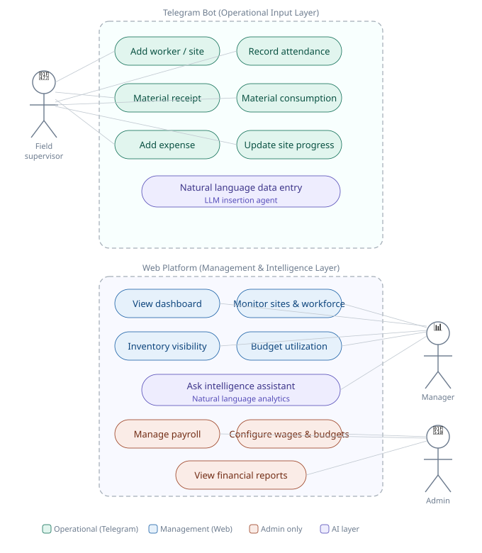
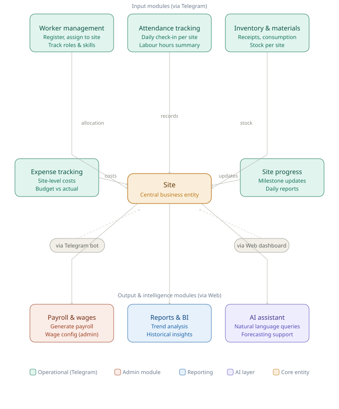

# Construction ERP & Resource Management System

## Project Overview

The Construction ERP & Resource Management System is an AI-powered, site-centric enterprise management platform designed for construction contractors to efficiently manage workforce operations, inventory movement, procurement activities, project budgets, and site-level execution from a centralized system.

The platform combines Telegram-based operational workflows, PostgreSQL-backed data management, AI-assisted data extraction through tool-calling agents, and a web-based analytics dashboard to streamline daily construction operations. The system enables supervisors and managers to record attendance, assign workers, manage material transactions, monitor project progress, track budgets, and generate operational reports without relying on traditional paper-based processes.

The platform is specifically designed for small and medium-scale construction businesses that require a practical and scalable solution for managing multiple sites while maintaining complete visibility over labour, materials, expenses, and project performance.

---

## Objective

To develop a centralized Construction ERP platform that digitizes and automates construction site operations by integrating workforce management, inventory management, procurement tracking, project budgeting, operational reporting, and AI-powered decision support.

The system aims to:

* Digitize daily construction operations.
* Centralize workforce and inventory records.
* Track site-wise material consumption and procurement.
* Automate attendance and payroll-related workflows.
* Monitor project budgets and expenses.
* Generate daily, weekly, and monthly operational reports.
* Provide management with real-time visibility across all active sites.
* Enable natural language interaction through AI-powered assistants.
* Build a historical data repository for future analytics and forecasting.

---

## Problem Statement

Small and medium-scale construction contractors frequently manage labour attendance, worker allocation, material procurement, inventory tracking, and project progress through manual registers, spreadsheets, phone calls, and messaging applications.

This approach often leads to:

* Inaccurate attendance records.
* Poor visibility across multiple construction sites.
* Untracked material consumption.
* Inefficient inventory management.
* Budget overruns.
* Delayed reporting.
* Lack of historical operational data.
* Difficulty in generating actionable business insights.

The absence of a centralized management platform limits operational efficiency and makes data-driven decision-making difficult.

This project addresses these challenges by providing an integrated Construction ERP solution that centralizes operational data, automates business workflows, and enables intelligent reporting through AI-assisted systems.

---

## User & Module Identification

The Construction ERP & Management Intelligence Platform is designed to centralize construction operations through multiple interconnected modules. Site Supervisors use the Telegram interface for operational data entry, while Contractors, Project Managers, Accountants, and Administrators access the web platform for monitoring, reporting, payroll management, and business analytics. The system also includes an AI-powered Management Assistant that enables authorized users to retrieve operational insights and reports using natural language queries.

---

## Modules list

* Workforce Management Module
* Site Management Module
* Inventory & Procurement Management Module
* Budget & Expense Management Module
* Payroll & Accounting Module
* Dashboard & Analytics Module
* AI Management Assistant Module
* Authentication & Access Control Module
  
---

## System Use Case Overview

## Site-Centric Module Breakdown

